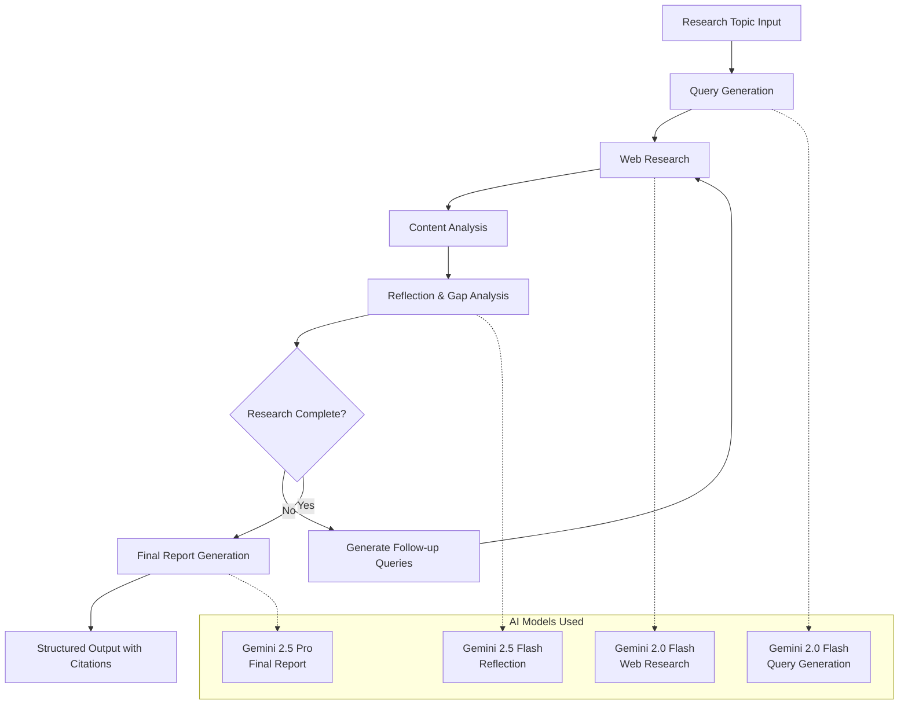
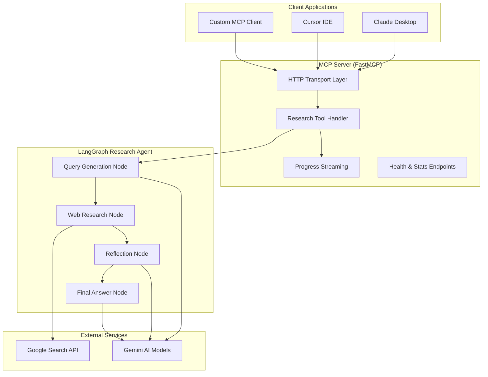
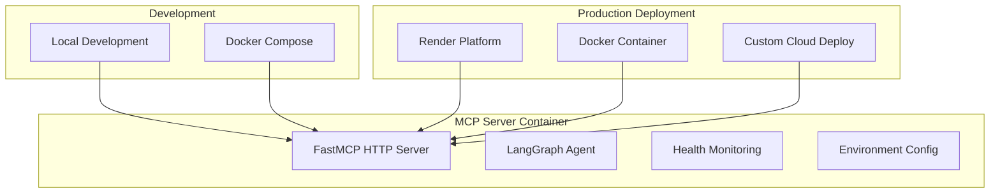

# Deep Research Agent MCP Server

🔍 **Intelligent AI Research Agent** - A sophisticated LangGraph-powered research agent wrapped as a Model Context Protocol (MCP) server for seamless integration with AI assistants like Claude, Cursor, and other MCP-compatible clients.

[](https://render.com/deploy)

## ✨ Features

### **Advanced Research Capabilities**
- **Multi-Step Research**: Conducts iterative web research with reflection and refinement loops
- **Google Search Integration**: Uses Google Search API with advanced grounding metadata
- **AI-Powered Analysis**: Leverages multiple Gemini models (2.0 Flash, 2.5 Flash, 2.5 Pro) for different tasks
- **Comprehensive Reports**: Generates structured research reports with proper citations and source verification
- **Configurable Depth**: Customizable research loops and query generation parameters

### **MCP Server Integration**
- **FastMCP Server**: Built on FastMCP for seamless MCP protocol support
- **Real-time Streaming**: Progress updates streamed to clients during research execution
- **HTTP Transport**: Accessible via HTTP for remote deployment and integration
- **Health Monitoring**: Built-in health checks and statistics endpoints
- **Error Handling**: Robust error handling with detailed logging

### **Deployment Ready**
- **Docker Support**: Containerized for easy deployment
- **Render Integration**: One-click deployment to Render platform
- **Environment Configuration**: Flexible configuration via environment variables
- **Scalable Architecture**: Designed for concurrent research requests

## Architecture

### Research Agent Workflow



### MCP Server Architecture



### Deployment Architecture



## 🚀 Quick Start

### 1. **Render Deployment (Recommended)**

Deploy to Render in 5 minutes:

1. **Fork this repository** to your GitHub account

2. **Create Render account** at [render.com](https://render.com)

3. **Deploy service:**
   - Click "New +" → "Web Service"
   - Connect your GitHub repository
   - Configure settings:
     ```
     Name: deep-research-mcp-server
     Runtime: Python 3
     Build Command: pip install -r requirements.txt
     Start Command: python -m src.mcp_server.server
     ```

4. **Add environment variables:**
   ```
   GEMINI_API_KEY = your_gemini_api_key_here
   PORT = 8000
   ```

5. **Deploy** and get your server URL: `https://your-service-name.onrender.com`

### 2. **Local Development**

```bash
# Clone repository
git clone https://github.com/your-username/deep-research-mcp.git
cd deep-research-mcp

# Install dependencies
pip install -r requirements.txt

# Set environment variables
export GEMINI_API_KEY=your_gemini_api_key_here

# Run MCP server
python -m src.mcp_server.server
```

### 3. **Docker Deployment**

```bash
# Build Docker image
docker build -t deep-research-mcp .

# Run container
docker run -p 8000:8000 \
  -e GEMINI_API_KEY=your_gemini_api_key \
  deep-research-mcp
```

## 🔧 Configuration

### Environment Variables

| Variable | Description | Default | Required |
|----------|-------------|---------|----------|
| `GEMINI_API_KEY` | Google Gemini API key | - | ✅ |
| `PORT` | Server port | 8000 | ❌ |
| `HOST` | Server host | 0.0.0.0 | ❌ |
| `LOG_LEVEL` | Logging level | info | ❌ |

### Research Parameters

Configure research behavior through the MCP tool parameters:

```json
{
  "topic": "Your research question",
  "max_research_loops": 2,
  "initial_search_query_count": 3,
  "reasoning_model": "gemini-2.5-pro"
}
```

## 📖 Usage

### With Claude Desktop

Add to your Claude Desktop configuration:

**macOS**: `~/Library/Application Support/Claude/claude_desktop_config.json`
**Windows**: `%APPDATA%\Claude\claude_desktop_config.json`

```json
{
  "mcpServers": {
    "deep-research": {
      "url": "https://your-service-name.onrender.com/mcp/"
    }
  }
}
```

### With Cursor IDE

Add to Cursor settings → MCP Servers:

```json
{
  "mcpServers": {
    "deep-research": {
      "url": "https://your-service-name.onrender.com/mcp/"
    }
  }
}
```

### Python Client Example

```python
from fastmcp import Client
import asyncio

async def research_example():
    client = Client("http://localhost:8000/mcp/")
    async with client:
        result = await client.call_tool("research", {
            "topic": "Latest developments in quantum computing",
            "max_research_loops": 3,
            "initial_search_query_count": 4
        })
        
        print("Research Report:")
        print(result["report"])
        print(f"\nSources: {len(result['sources'])}")
        print(f"Execution time: {result['metadata']['execution_time']:.2f}s")

asyncio.run(research_example())
```

## 🛠️ Development

### Project Structure

```
deep-research-mcp/
├── src/
│   ├── agent/                    # LangGraph research agent
│   │   ├── app.py               # FastAPI app
│   │   ├── graph.py             # LangGraph workflow definition
│   │   ├── state.py             # State management
│   │   ├── prompts.py           # AI prompts
│   │   ├── tools_and_schemas.py # Tools and data schemas
│   │   ├── configuration.py     # Agent configuration
│   │   └── utils.py             # Utility functions
│   └── mcp_server/              # MCP server implementation
│       ├── server.py            # FastMCP server
│       ├── agent_adapter.py     # Agent wrapper
│       ├── config.py            # Configuration management
│       └── utils.py             # Server utilities
├── ClinicalTrials-MCP-Server/   # Additional MCP server example
├── examples/                    # Usage examples
├── requirements.txt             # Python dependencies
├── pyproject.toml              # Project configuration
├── render.yaml                 # Render deployment config
└── README.md                   # This file
```

### Local Testing

```bash
# Install development dependencies
pip install -r requirements.txt

# Run tests
python -m pytest tests/

# Start server in development mode
python -m src.mcp_server.server

# Test health endpoint
curl http://localhost:8000/health

# Test MCP endpoint
curl -X POST http://localhost:8000/mcp/ \
  -H "Content-Type: application/json" \
  -d '{"method": "tools/list", "params": {}}'
```

## 📊 Monitoring

### Health Check

```bash
curl https://your-service-name.onrender.com/health
```

Response:
```json
{
  "status": "healthy",
  "service": "Deep Research MCP Server",
  "version": "1.0.0",
  "agent_status": "healthy"
}
```

### Statistics

```bash
curl https://your-service-name.onrender.com/stats
```

### Logging

The server provides structured logging with:
- Request/response tracking
- Research progress updates
- Error reporting and debugging
- Performance metrics

## 🔒 Security

- **API Key Protection**: Environment variable-based secret management
- **Input Validation**: Comprehensive input sanitization
- **Rate Limiting**: Built-in request throttling
- **Error Handling**: Secure error responses without sensitive data exposure

## 📝 License

This project is licensed under the MIT License - see the [LICENSE](LICENSE) file for details.